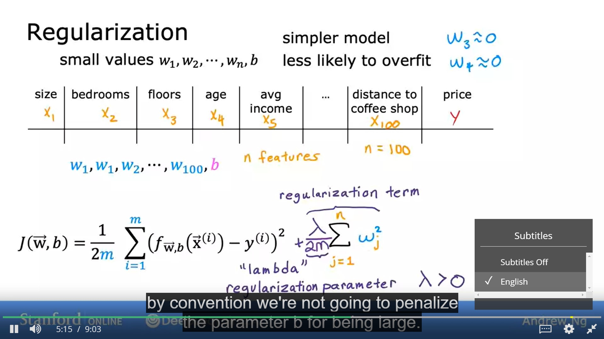
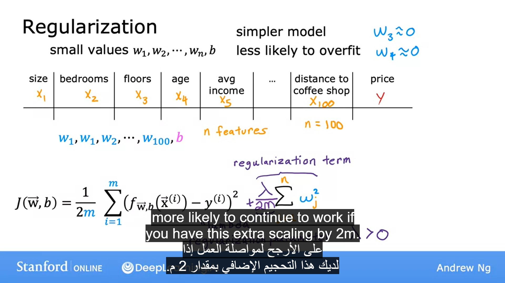
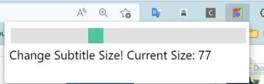
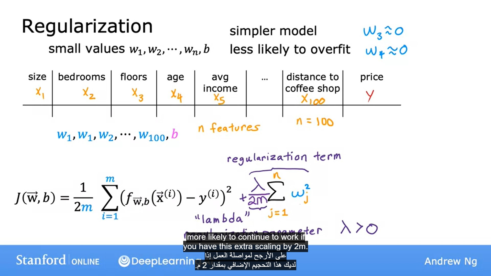
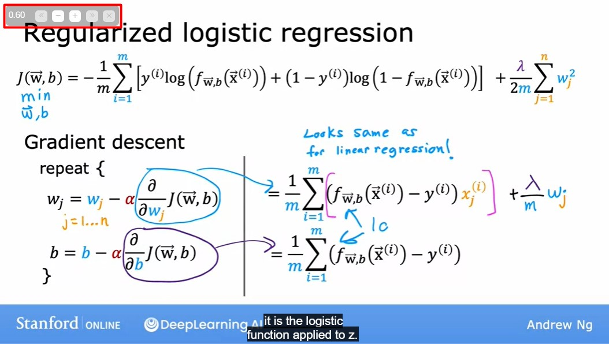
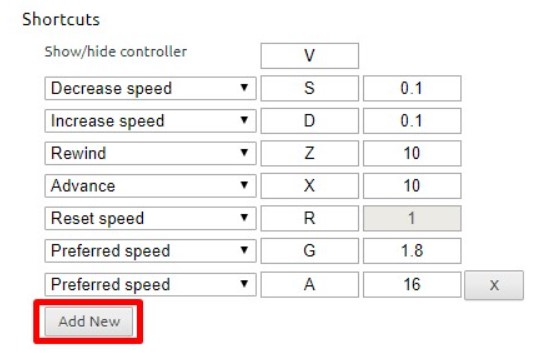

# Get a better watching experience on Coursera!

In this repository, I recommend a very useful extension to get a better watching experience on Coursera.

### EXTENSIONS

- [Coursera subtitle translation to Arabic](https://github.com/imAbdelhadi/coursera-subtitle-translation-arabic)
- [Coursera Subtitle Resizer](https://chrome.google.com/webstore/detail/coursera-subtitle-resizer/eaiabkjipjhalikppkkjoeefjnphgbpe)
- [Video Speed Controller](https://chrome.google.com/webstore/detail/video-speed-controller/nffaoalbilbmmfgbnbgppjihopabppdk)

## Coursera subtitle translation to Arabic [[Extension Link]](https://github.com/imAbdelhadi/coursera-subtitle-translation-arabic)

Turn on bilingual subtitles in Arabic and English for Coursera course videos.

- If the course has both Arabic and English subtitles, open it directly.
- If the course does not have Arabic subtitles, English subtitles will be automatically translated.

### Before:

### After:

## Coursera Subtitle Resizer [[Extension Link]](https://chrome.google.com/webstore/detail/coursera-subtitle-resizer/eaiabkjipjhalikppkkjoeefjnphgbpe)

This extension come with a wonderful minimalistic slider, So that you can read the slides clearly

### Before:

### After:

## Video Speed Controller [[Extension Link]](https://chrome.google.com/webstore/detail/video-speed-controller/nffaoalbilbmmfgbnbgppjihopabppdk)

Once the extension is installed simply navigate to any Video, and you'll see a speed indicator in top left corner. Hover over the indicator to reveal the controls to accelerate, slowdown, and quickly rewind or advance the video. Or, even better.

####  **simply use your keyboard:**

- **S** - decrease playback speed.
- **D** - increase playback speed.
- **R** - reset playback speed to 1.0x.
- **Z** - rewind video by 10 seconds.
- **X** - advance video by 10 seconds.
- **G** - toggle between current and user configurable preferred speed.
- **V** - show/hide the controller.

You can customize and reassign the default shortcut keys in the extensions settings page, as well as add additional shortcut keys to match your preferences. For example, you can assign multiple different "preferred speed" shortcuts with different values, which will allow you to quickly toggle between your most commonly used speeds. To add a new shortcut, open extension settings and click "Add New".

